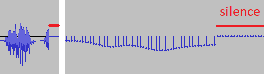
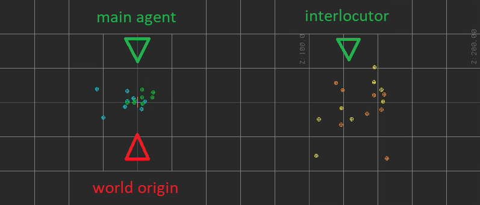
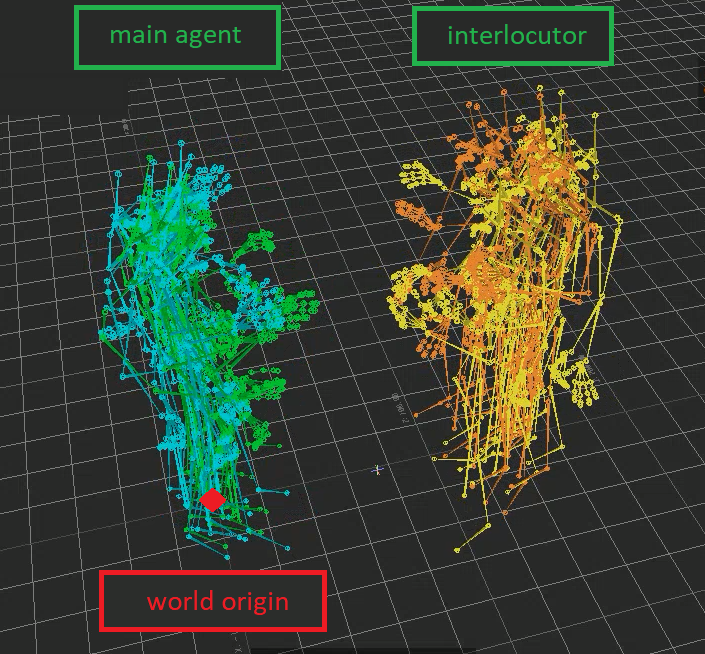
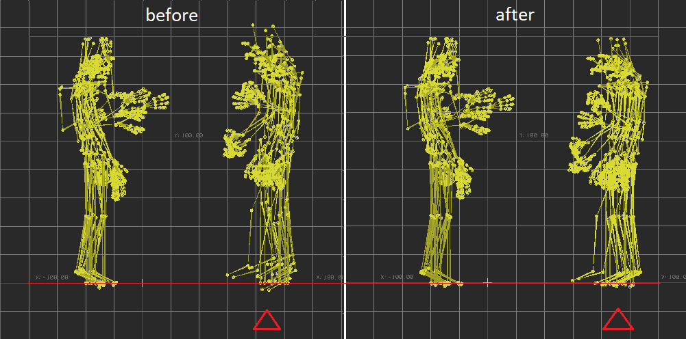

- [Updates](#updates)
- [Introduction](#introduction)
- [Dataset](#dataset)
  * [Release schedule](#release-schedule)
    + [Phase 1 - Train and validation data](#phase-1---train-and-validation-data)
    + [Phase 2 - Test data](#phase-2---test-data)
    + [Known issues V0](#known-issues-v0)
  * [Folder structure](#folder-structure)
    + [Folders](#folders)
    + [Files](#files)
    + [Content remarks](#content-remarks)
    + [Preview](#preview)
  * [Data splits](#data-splits)
- [Data processing](#data-processing)
  * [Data normalization](#data-normalization)
  * [Annotation procedure and conventions](#annotation-procedure-and-conventions)
  * [Feature extraction scripts](#feature-extraction-scripts)
    + [Scripts from 2023](#scripts-from-2023)
    + [Scripts from 2022](#scripts-from-2022)

<small><i><a href='http://ecotrust-canada.github.io/markdown-toc/'>Table of contents generated with markdown-toc</a></i></small>

# Updates
Check this section for updates relating to the dataset. We will also notify you via email and Slack (if you have joined).
- 2023-05-02 (May 2nd) - Train and validation data download link: [Google Drive](https://drive.google.com/drive/u/1/folders/1QeP6e5LMgYRGkpP1Vb05rg_LKq_5Qhv2)
- 2023-06-07 (Jun 7th) - Test data download link: TBA

# Introduction
This page contains the main information you need to know about the GENEA Challenge 2023 dataset and data processing.

The data for the GENEA Challenge 2023 has been adapted from [Talking With Hands 16.2M](https://github.com/facebookresearch/TalkingWithHands32M). It comes from recordings of dyadic interactions between different speakers. For the GENEA Challenge 2022, each dyadic interaction was separated into two independent sides with one speaker each. However, this year we are expanding the scope to include the entirety of dyadic interactions. This entails the inclusion and temporal synchronization of information from both speakers, which necessitated changes to the folder structure and data normalization procedure we used.

Please take note of the following nomenclature when proceeding with this document:
- `main agent` or `main-agent` refers to the speaker in the dyadic interaction for which your system will generate motions. The entire data normalization process we used was based on this speaker.
- `interlocutor` or `interloctr` refers to the speaker in front of the `main agent`. Motions should not be generated for the `interlocutor`.

# Dataset
## Release schedule
The full GENEA Challenge 2023 dataset is scheduled to be released in two phases. If any issues are found that warrant re-extraction of the data after it was released, you will be promptly notified as soon as it is made available.

**Disclaimer!** The GENEA Challenge 2023 dataset is released only to challenge *participants*. This is not the public version of the dataset, and it **should not** be made public.

### Phase 1 - Train and validation data
Train and validation data is released to participants on **2023-05-02** (May 2nd). This data contains motion, audio, and transcriptions for all audio files for both the `main agent` and `interlocutor` speakers. The *train* data has also been augmented such that the same interaction appears twice, but with the speakers swapped.

This is the latest link: [Google Drive](https://drive.google.com/drive/u/1/folders/1QeP6e5LMgYRGkpP1Vb05rg_LKq_5Qhv2)

### Phase 2 - Test data
Test data will be released to participants on **2023-06-07** (June 7th). The data will follow the same format as the validation set, and has been selected using the same criteria, except that motion data (BVH) is not included for the `main agent`.

### Known issues V0
There are currently no known issues in the `v0` dataset.

Note that the data is not perfect, and there are still some details you should be aware of when building your systems. We do not treat these as *issues* with the data, but instead as *properties* of the data. You can read more about them in the [Content remarks](#content-remarks) section.

## Folder structure
Below you can find information about how the folders and files are structured in the GENEA Challenge 2023 dataset. The file structure is similar to GENEA Challenge 2022, but adjustments have been made to accommodate the dyadic nature of GENEA Challenge 2023.

### Folders
- `bvh/` (motion): Time-aligned 3D full-body motion-capture data in BVH format from a speaking and gesticulating actor. Each file is a single person, but each data sample contains files for both the `main agent` and the `interlocutor`. Some files include finger motion capture, whilst others do not (see the section on metadata below). Files without finger-motion data will generally have fixed rotations for the finger joints, corresponding to the default found in a T-pose. The data has been normalized such that – on average for each recording in the source data – the character root is at the world origin (0,0) on the ground plane and their heading (rotation around the positive z axis) faces the camera in the visualization.
- `wav/` (audio): Recorded audio data in WAV format from a speaking and gesticulating actor with a close-talking microphone. Each file is mono and contains the audio from a single person only, but each data sample contains files for both the `main agent` and the `interlocutor`. Parts of the audio recordings have been muted to omit personally identifiable information. You can identify these portions by looking for places where the audio is completely silent (completely zeroed out).
- `tsv/` (text): Word-level time-aligned text transcriptions of the above audio recordings in TSV format (tab-separated values). Each file corresponds to a single speaker, but each data sample contains files for both the `main agent` and the `interlocutor`. For privacy reasons, the transcriptions do not include references to personally identifiable information, similar to the audio files. Each line in a TSV file contains three fields, separated by tabs: the start time of a time interval (in seconds), the end time of that interval (in seconds), and a text transcription of the speaker's speech in the time interval. Note that some annotations contain more than one word. More information about how these annotations were created is provided further below in this document.
- `main-agent/` (main agent): Encapsulates BVH, TSV, WAV data for the `main agent`.
- `interloctr/` (interlocutor): Encapsulates BVH, TSV, WAV data for the `interlocutor`.
- `trn/`, `val/`, `tst/` (data splits): Data contained for the train, validation, and test splits respectively. Each split is distributed as a separate `.zip` file, and contains data for the `main agent` and the `interlocutor`.

### Files
All files in the leaf directories of the dataset follow the same naming convention `<split>_<year>_<version>_<sample_ID>_<speaker>.<extension>` where:
- `split` : The data split, which is either `trn`, `val`, or `tst`.
- `year` : The year of the GENEA Challenge for which this dataset is extracted.
- `version` : The dataset version. We start from `v0`, and if issues are found that warrant data re-extraction, we will increment the version in future releases.
- `sample_ID` : A unique identifier (ID) for each data sample in each data split. All files matching this ID correspond to the same segment of dyadic interaction, making them temporally synchronized. The ID is a three-digit number with leading zeroes (`000` and up).
- `speaker` : Which speaker this file is intended for. It is either `main-agent` or `interloctr`.
- `extension` : The file extension of the file. One of `.bvh` (motion), `.wav` (audio), `.tsv` (text).

Examples:
- `trn_2023_v0_007_main-agent.tsv`
- `trn_2023_v0_004_interloctr.wav`
- `val_2023_v0_020_main-agent.wav`
- `val_2023_v0_037_interloctr.bvh`

There is also a file `metadata.csv` in each data split, with metadata about the recordings in the train, validation, and test sets, one line per recording. Each line contains five fields, separated by commas:
- `prefix` : The filename prefix of the specific recording
- `main-agent_id` : Numeric speaker ID corresponding to a single actor in the original data.
- `main-agent_has_fingers` : Indicator of whether `main agent` has fingers animation. Either `fingers_incl` or `fingers_excl`.
- `interloctr_id` : Numeric speaker ID corresponding to a single actor in the original data.
- `interloctr_has_fingers` : Indicator of whether `interlocutor` has fingers animation. Either `fingers_incl` or `fingers_excl`.

Every actor in the data has a unique two-digit numeric ID, and every file tagged with that speaker ID corresponds to data from the same actor, regardless of whether the file is from the training, validation, or test set.

### Content remarks
Be aware of the following peculiarities of the GENEA Challenge 2023 data:

- Two TSV files in the data are empty because the corresponding speaker does not say anything during the recording.
	- `trn_2023_v0_139_main-agent.tsv`
	- `trn_2023_v0_181_interloctr.tsv`
- Segments of the audio are silenced (zero values) by Meta in order to censor private information spoken by the recorded speakers. The waveform around the silenced audio is unaffected as zero-crossing is not enforced. This also leads to audible "pops" at the start and end of the silenced segment.

  
   
  <i>Audio waveform with silenced audio. Zero-crossing is not forced outside the silenced region.</i>

- Motion data has occasional glitches, primarily at the wrists joints and fingers. These glitches are present in the original TWH data. For example:
	- `trn_2023_v0_153_main-agent.bvh` in `trn/` after frame `1570` (~52s) on the left wrist

### Preview
Below is a preview of the GENEA Challenge 2023 dataset folder structure Folder names are *italic*; file names are not:
- *root*
	- *trn*
		- *main-agent*
			- *bvh*
				- trn_2023_v0_000_main-agent.bvh
				- trn_2023_v0_001_main-agent.bvh
				- ...
			- *tsv*
				- trn_2023_v0_000_main-agent.tsv
				- trn_2023_v0_001_main-agent.tsv
				- ...
			- *wav*
				- trn_2023_v0_000_main-agent.wav
				- trn_2023_v0_001_main-agent.wav
				- ...
		- *interloctr*
			- *bvh*
				- trn_2023_v0_000_interloctr.bvh
				- trn_2023_v0_001_interloctr.bvh
				- ...
			- *tsv*
				- trn_2023_v0_000_interloctr.tsv
				- trn_2023_v0_001_interloctr.tsv
				- ...
			- *wav*
				- trn_2023_v0_000_interloctr.wav
				- trn_2023_v0_001_interloctr.wav
		- metadata.csv
	- *val* - same structure as *trn* folder
	- *tst* - same structure as *trn* folder, with *main-agent/bvh* removed

## Data splits
We made some adjustments to increase the dataset size:
- The 2022 validation set is now included in the 2023 train set.
- The 2022 test set is now the 2023 validation set.
- The 2023 train set has been *augmented*. This means that the same original interaction between speakers A and B is featured twice. Once with A being the `main agent` and B being the `interlocutor`, and once with B being the `main agent` and A being the `interlocutor`.

The validation and test data uses a similar organisation, folder structure, and metadata file as the training data, except that:
- The validation data has not been augmented, in order to retain a similarity to the test data used later during the challenge. The validation set therefore shows you what the evaluation material will look like, and is intended to help you tune your models. Validation and test data only contain speakers that also are part of the training data.
- The test set will not contain BVH files for the `main agent`. Instead, your system will be responsible for generating those BVH files, and submitting them for evaluation. It is acceptable to train your system on the validation set for the final submission, but training on any test-set materials is not permitted. The final subjective evaluation is performed on a set of short pieces of speech and corresponding motion selected from the test set.

We guarantee there is no overlap between the following data splits; 2022 corresponds to GENEA Challenge 2022 data, and 2023 to GENEA Challenge 2023 data:
- 2022 TRN - 2023 VAL (main agent, interlocutor)
- 2022 TRN - 2023 TST (main agent, interlocutor)
- 2022 VAL - 2023 VAL (main agent, interlocutor)
- 2022 VAL - 2023 TST (main agent, interlocutor)
- 2022 TST - 2023 TST (main agent, interlocutor)
- 2023 TRN (main agent, interlocutor) - 2023 VAL (main agent, interlocutor)
- 2023 TRN (main agent, interlocutor) - 2023 TST (main agent, interlocutor)
- 2023 VAL (main agent, interlocutor) - 2023 TST (main agent, interlocutor)

# Data processing
## Data normalization
The GENEA Challenge 2023 dataset largely resembles that of the GENEA Challenge 2022; we used the same [2022 data-processing procedure](https://github.com/TeoNikolov/genea_visualizer/tree/archive_2022/scripts), with several modifications:
- Each dataset sample now contains data for two speakers: *main agent* and *interlocutor*. The *main agent* contains data similar to the GENEA Challenge 2022, in that it is root-normalized to (1) be positioned at world origin *[0,0,0]* on average, and to (2) be oriented to look in the direction of the positive Z axis on average (right-hand XYZ, Y-up). The same transformation has been applied to the *interlocutor*, who is always facing, and positioned in front of, the *main agent*. Upon visual inspection, the *interlocutor* seems to remain in roughly the same location throughout the whole dataset.

  
   
  <i>Top-down visualization of the position of the "main agent" (left) and "interlocutor" (right), for various takes.</i>

  
   
  <i>Perspective visualization of the position of the "main agent" (left) and "interlocutor" (right), for various takes.</i>

- The hip height of all skeletons has been made constant. This was done because all skeletons in the original TWH have the same proportions, except for the hip height. The variance in hip height would cause most of the skeletons to float above the ground. By fixing the height to be constant, the skeletons would normally be touching the ground with their feet.

  
   
  <i>Visualization of hip-height correction; before (left) and after (right).</i>

- We used MotionBuilder 2023 and Maya 2023, instead of MotionBuilder 2022 and Maya 2022. This did not appear to have any effect on the final data after the retargeting and root normalization steps.

## Annotation procedure and conventions
To create the TSV transcription files, the audio recordings were first transcribed using commercial automatic speech recognition. The resulting transcriptions were then manually corrected and edited to improve their suitability for automatic text processing and gesture generation, e.g., by writing out ambiguous contractions, correcting grammar mistakes, adding punctuation, and annotating filled pauses. As a result of this process, some annotations contain more than one word.

The transcription guidelines given to the annotators who performed the manual edits have been recorded in an [annotation manual, available on Google Drive](https://docs.google.com/document/d/1mxaFPiZlknZjTbB2HZj-bpRGa7G19iPgGUZK7MWfsMQ). The same document also lists a number of known issues with the annotations. If you correct any issues with the annotations, you are encouraged to share the corrected TSV files with the organisers and with other teams.

## Feature extraction scripts
We provide a number of optional scripts for encoding and processing the challenge data for several years of the GENEA Challenge.

### Scripts from 2023

Audio, Text, and Motion: We provide a script that unifies feature extraction of all three modalities in a single routine.
- [`process_data.py`](https://github.com/genea-workshop/2023_ivi_baseline/blob/fe7827bc95f8a1123f26c25c0fe0173ae8d8ee51/process_data.py#L165-L244) : `prepare_h5_unclipped` is the entry point for extracting features for audio, text, and motion modalities. **Text** features (fastText) are also extracted here for each word from the transcripts.
- [`process_data.py`](https://github.com/genea-workshop/2023_ivi_baseline/blob/fe7827bc95f8a1123f26c25c0fe0173ae8d8ee51/process_data.py#L62-L100) : `load_bvh_jointselector` transforms BVH **motion** data into exponential maps representation.
- [`tool.py`](https://github.com/genea-workshop/2023_ivi_baseline/blob/main/tool.py) contains some **audio** feature extraction methods, such as MFCC, prosody, spectrogram.

You may find additional materials in the code for our GENEA Challenge 2023 baseline systems via the challenge [`baselines` folder](https://github.com/genea-workshop/genea_challenge_2023/tree/main/baselines). Note that these systems are intended for GENEA Challenge 2023.

### Scripts from 2022

Audio: Scripts for extracting basic audio features, such as spectrograms, prosodic features, and mel-frequency cepstral coefficients (MFCCs) can be found [at this link](https://github.com/genea-workshop/Speech_driven_gesture_generation_with_autoencoder/blob/GENEA_2022/data_processing/tools.py#L105).

Text: A script to encode text transcriptions to word vectors using FastText is available. [`tsv2wordvectors.py`](https://gist.github.com/youngwoo-yoon/c9e5d5b04994478011911f88eb15caa4)

Motion: If you wish to encode the joint angles from the BVH files to and from an exponential map representation, you can use scripts by [Simon Alexanderson](https://github.com/simonalexanderson) based on the [PyMo library](https://omid.al/projects/pymo/), which are available here:
* [`bvh2features.py`](https://github.com/genea-workshop/Speech_driven_gesture_generation_with_autoencoder/blob/GENEA_2022/data_processing/bvh2features.py)
* [`features2bvh.py`](https://github.com/genea-workshop/Speech_driven_gesture_generation_with_autoencoder/blob/GENEA_2022/data_processing/features2bvh.py)

We provide code for several baseline systems via the challenge [`baselines` folder](https://github.com/genea-workshop/genea_challenge_2022/tree/main/baselines). These baselines also contain some data processing scripts. Note that these systems are intended for GENEA Challenge 2022.
